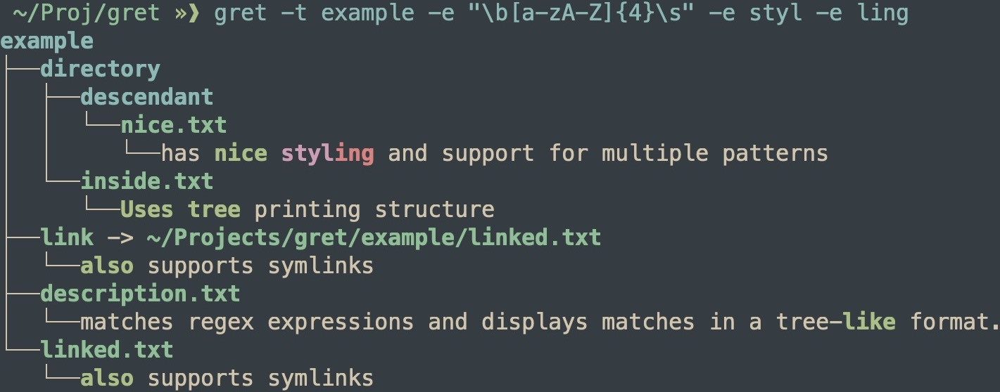

### gret

gret (global regular expression tree) is a command
line tool that searches a directory or file
for a matching regex expression and displays
matches in a tree structure.



#### To Run
Use *cargo run*, the first positional argument
is the pattern, the second is the path to search. If
you want to match multiple patterns use *-e* followed
by the pattern.

#### To Install
Run the *./add_to_path.sh* script after changing the
links location to somewhere on your path. Or run
the commands seperately:
```
cargo build --release
```
And then source the correct completion file that is in the
*completions/* directory.

#### To Benchmark
Run *./benchmarks/bench* at the root directory. Results can be seen in the
*times* file in the *benchmarks* directory.

Then add the binary to your path and then source the
script to give you proper completions. For the completions
to work on next login you must source it at each login.

| Shell |Completion Script to Source |
|----| ---|
|BASH       |completions/gret.bash|
|Zsh        | completions/_gret|
|Fish       | completions/gret.fish|
|Elvish     |completions/gret.elv|
|PowerShell | _gret.ps1|

